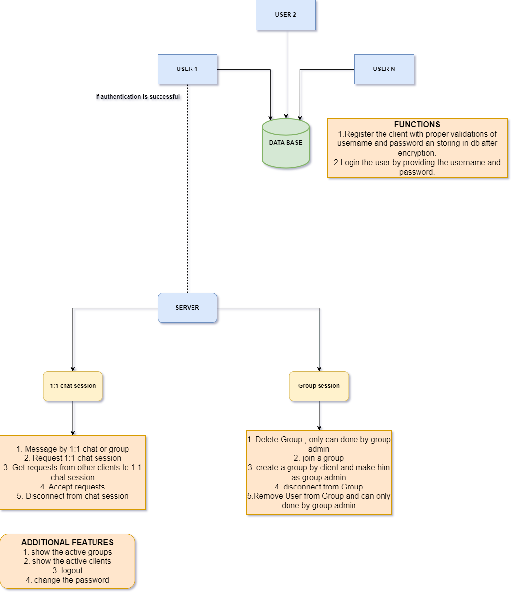

**Terminal Chat Application using Node.js with TCP/IP Protocol**   
**1. Introduction**  
This application is developed using Node.js with TCP/IP protocol. The application allows users to chat with one another. The server can handle multiple clients simultaneously, and the clients can communicate with one another through both 1:1 chat and group chat. Additionally, the application includes several features, such as authentication, group management, and encryption.
   
**2.Technical Diagram:**  
 

**3. Dependencies**   
The chat application requires the following software and hardware specifications: 
Node.js  
MongoDB 
To run the chat application, follow these steps: 
Start the server by running **node server.js**. 
Start a client by running **node start.js** and on successful authentication user will be redirected to connect with server. 

**4. Authentication**  
The chat application uses a fixed username and password for client authentication. The client must provide a valid username and password to connect to the server. The server checks the provided credentials against a MongoDB database of registered users. If the credentials are valid, the server grants the client access to the chat application. 
The password is encrypted and stored in the MongoDB database using a **public-private key encryption strategy**. In the database the password is stored in encrypted format after performing the encryption with public key. 
--> the user can not do multiple logins with the same username and password.   

**5. Group Chatting**  
The chat application allows users to create, join, and manage groups. Only the group administrator can delete a group or remove a user from a group. The following group  functions are available to users: 
**Create Group**: Users can create a new group and become the group administrator. If the group already exist, he can’t create the group with the same name. 
**Join Group**: Users can join an existing group by providing the group name. And if user joins the group, he will get messages if anyone from that group sends a message. 
**Delete Group**: The group administrator can delete a group by providing the group name. 
**Remove User from Group**: The group administrator can remove a user from a group by providing the username. 
**Disconnect From Group**: Users can disconnect from the group they have joined by providing the username. The users are allowed to join another group only if he exits from the current group.   

**6. Chat Functionality**  
The chat application supports both 1:1 chat and group chat. Users can send messages, request 1:1 chat session, accept 1:1 chat request, and disconnect from 1:1 chat or group chat sessions. The following chat functions are available to users: 

**Send Message**: Users can send a message to a specific user by providing the recipient's id. And the message can be only sent to the other user if recipient user accepts the request. 
**Request 1:1 Chat Session**: Users can request a 1:1 chat session with another user by providing the id. The recipient will receive a chat request and can choose to accept the request from sender. 
**Get Requests**: Users can get a list of requests who have made a 1:1 chat request with the clients. This functionality helps the user to accept a request. 
**Accept 1:1 Chat Request**: If a user receives a 1:1 chat request, they can choose to accept the request and begin a 1:1 chat session. 
**Disconnect from 1:1 Chat Session**: Users can disconnect from an ongoing 1:1 chat session at any time by entering the recipient client id.   

**7. Other Chat Features**  
The chat application includes the following additional features: 
**Show Active Clients**: Users can view a list of all active clients currently connected to the server. 
**Show Active Groups**: Users can view a list of all active groups currently available in the chat application. 
**Change Password**: Users can change their password by providing the new password. 
**Logout**: Users can disconnect from the server and log out of the chat application at any time.   

**8. Conclusion**  
The terminal chat application developed using Node.js with TCP/IP protocol provides a platform for users to communicate with one another. The application includes several features such as authentication, group management, and encryption. 
